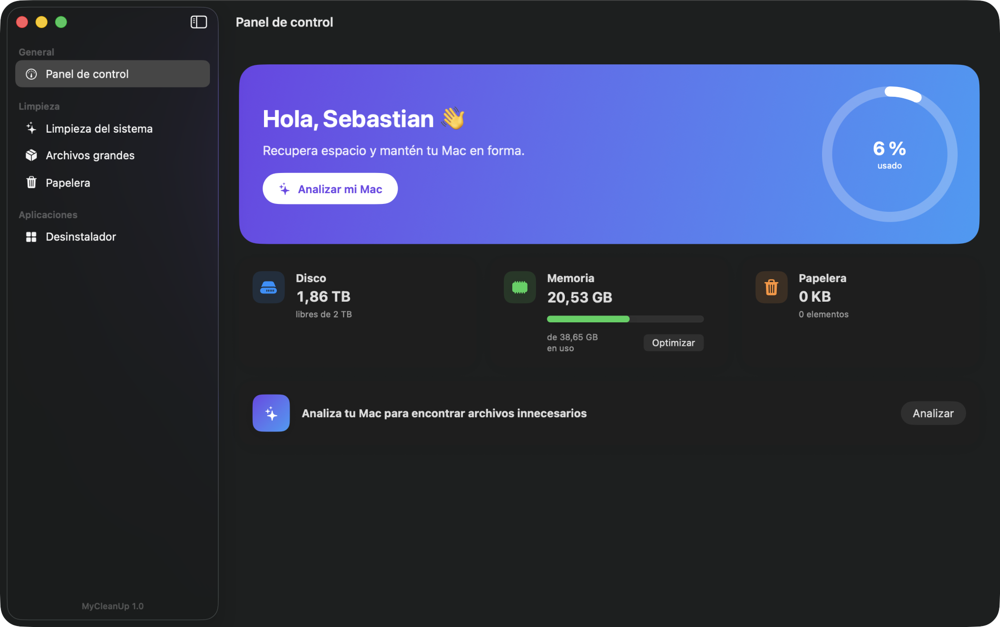
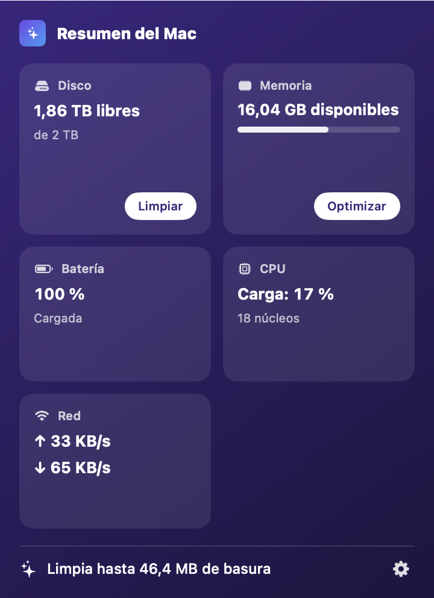
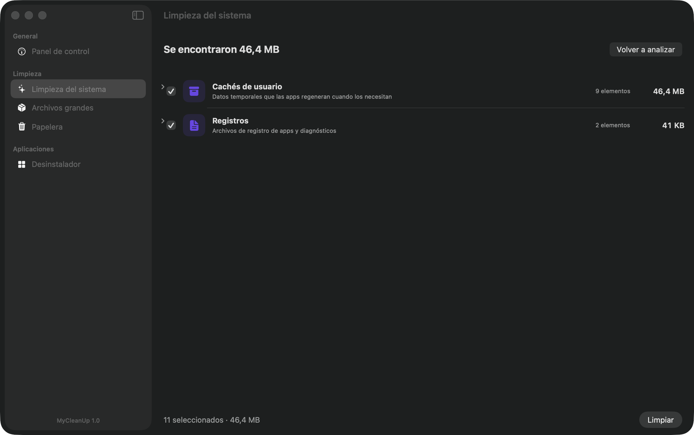
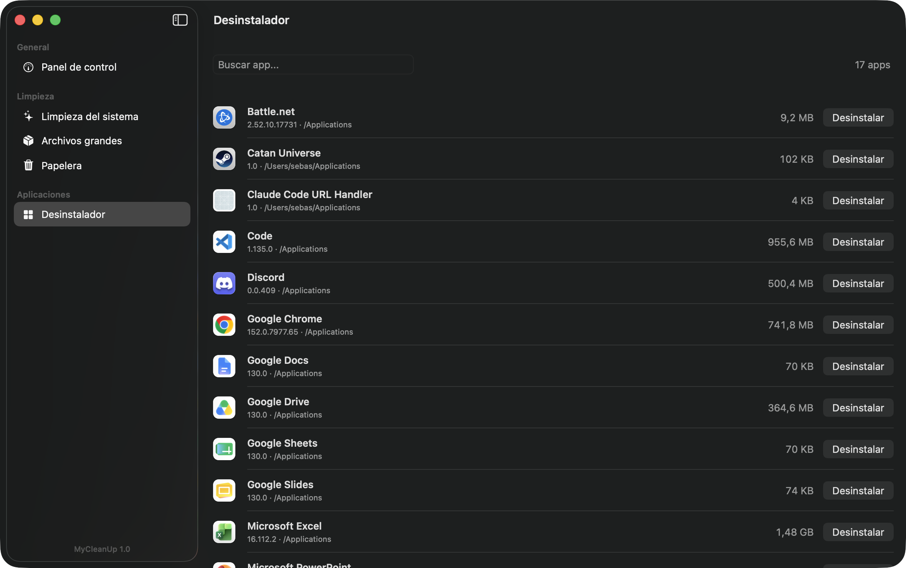

# MyCleanUp

Utilidad nativa de macOS para limpiar y mantener tu Mac, al estilo CleanMyMac. Hecha en SwiftUI, compilada solo con Command Line Tools (sin Xcode, sin SPM). Interfaz completa en español.

## Capturas

| Panel de control | Barra de menús |
| --- | --- |
|  |  |

| Limpieza del sistema | Desinstalador |
| --- | --- |
|  |  |

## Compatibilidad

- **macOS 13 Ventura o posterior** (`LSMinimumSystemVersion` 13.0; las APIs de SwiftUI usadas, como `NavigationSplitView` y `MenuBarExtra`, requieren macOS 13).
- **Apple Silicon (M1 o posterior)**: el script compila para la arquitectura del equipo (`uname -m`). En un Mac Intel se puede compilar igual (el script usará `x86_64-apple-macos13.0`), pero solo se ha verificado en Apple Silicon.
- Desarrollada y verificada de extremo a extremo en macOS 26.6 con Apple Silicon.

## Funcionalidades

- **Panel de control**: espacio en disco (anillo de uso), memoria RAM en uso, estado de la Papelera y acceso rápido al análisis.
- **Limpieza del sistema**: encuentra y elimina basura por categorías:
  - Cachés de usuario (`~/Library/Caches`)
  - Registros (`~/Library/Logs`)
  - Cachés de desarrollo (DerivedData de Xcode, caché de npm, `~/.cache`, cachés del simulador)
  - Estado guardado de apps (no preseleccionado)
  - Soporte de dispositivos iOS (no preseleccionado)
- **Archivos grandes**: busca archivos de más de 50 MB / 100 MB / 500 MB / 1 GB en tu carpeta de usuario y los mueve a la Papelera (reversible).
- **Desinstalador**: lista las apps de `/Applications` y `~/Applications`, encuentra sus archivos residuales (Application Support, Caches, Preferences, Containers, LaunchAgents, etc.) y mueve todo a la Papelera.
- **Papelera**: muestra tamaño y cantidad de elementos, y la vacía con confirmación.
- **Barra de menús**: icono persistente con popover "Resumen del Mac": disco (con acceso a limpieza), memoria disponible con botón **Optimizar** (fuerza al kernel a soltar páginas inactivas, solo cuando hay presión real y con topes de seguridad), batería con temperatura, carga y temperatura de CPU, velocidad de red y resumen de basura encontrada.

## Seguridad

- Toda eliminación pasa por un único punto (`Remover`) que rechaza cualquier ruta fuera de una lista blanca de directorios seguros, resolviendo symlinks antes de comparar.
- La limpieza de basura es definitiva pero siempre con diálogo de confirmación; los archivos grandes y las apps desinstaladas se mueven a la Papelera (reversible).
- Nunca se preseleccionan categorías con efectos secundarios (estado de ventanas, símbolos de iOS).
- Las apps de Apple (`com.apple.*`) quedan excluidas del desinstalador.

## Compilar

```bash
./scripts/build.sh     # genera build/MyCleanUp.app (firma ad hoc + icono)
./scripts/test.sh      # prueba de humo del núcleo (solo usa directorios temporales)
```

Instalar en Aplicaciones:

```bash
ditto build/MyCleanUp.app /Applications/MyCleanUp.app
```

## Verificación E2E

La app tiene un modo oculto de evidencia visual que recorre todas las secciones con datos reales y guarda capturas PNG de su propia ventana (no requiere permiso de grabación de pantalla):

```bash
build/MyCleanUp.app/Contents/MacOS/MyCleanUp --snapshot docs/capturas
```

Las capturas de la última verificación están en `docs/capturas/`.

## Permisos de macOS

Al analizar archivos grandes por primera vez, macOS puede pedir permiso para acceder a Escritorio, Documentos y Descargas. Es normal: acéptalo para que el análisis sea completo. Los cachés y registros no requieren permisos especiales.

## Alcance

Sin módulo de malware/antivirus ni "protección" (fuera de alcance) ni test de velocidad de internet (la app es 100% local, sin red). El foco es limpieza de espacio, desinstalación completa de apps y el resumen de sistema de la barra de menús.

Nota sobre la temperatura de CPU: en Apple Silicon no hay API pública, así que se lee con la interfaz de sensores HID (`IOHIDEventSystemClient`) resuelta en tiempo de ejecución con `dlsym`, la misma que usan iStat Menus o Stats. Si alguna versión de macOS la cambia, la app muestra la tarjeta sin temperatura en vez de fallar. La temperatura de batería sí usa API pública (`AppleSmartBattery` en el registro de IOKit).

## Estructura

```
Sources/Core/    lógica pura (escáneres, borrado seguro, métricas) - testeable por CLI
Sources/App/     app SwiftUI (vistas, modelos, modo snapshot)
Tests/smoke.swift prueba de humo del núcleo
scripts/         build, test y generador del icono
```
